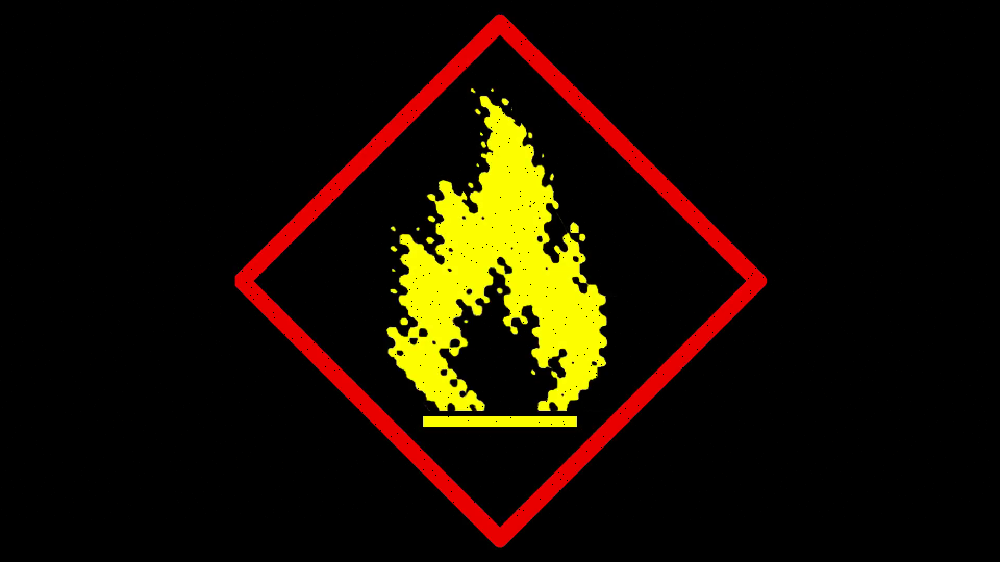
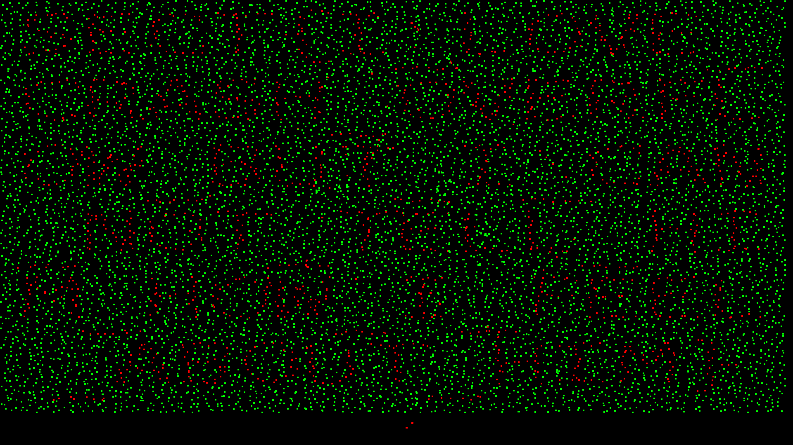

## Acid Burn - 200

### Description

> I suspect Acid Burn is hiding something in her background image, but I can't quite figure out what is it. Can you help me?

### Write up



이미지파일 하나가 달랑 주어져있다.

확대해서 살펴보면 그림 중간 중간에 부자연스럽게 검은 점들이 찍혀있는 것을 확인할 수 있다.

해당 점의 RGB 값을 확인해보면, (3,3,3)과 (4,3,0)이 섞여있다.

```python

from PIL import Image

img = Image.open('chall.webp')
res = Image.new('RGB', img.size)
px = img.load()
res_px = res.load()

for x in range(0, img.width):
	for y in range(0, img.height):

#		if px[x, y] != (0, 0, 0) and px[x, y] != (3, 3, 3) :
#			print(px[x, y])

		if px[x, y] == (3, 3, 3) or px[x, y] == (4, 3, 0):
			for xx in range(0, 4):
				for yy in range(0, 4):
					try:
						res_px[x+xx, y+yy] = (0, 255, 0)
					except:
						pass

		if px[x, y] == (4, 3, 0):
			for xx in range(0, 4):
				for yy in range(0, 4):
					try:
						res_px[x+xx, y+yy] = (255, 0, 0)
					except:
						pass

res.save("ans.png")

```

해당하는 점들만 색을 다르게 칠하는 스크립트를 작성한다.



> SECT{I_LOVE_CRASH_OVERFLOW_BUT_I_CAN_NOT_TELL_HIM_HOW_I_FEEL_ABOUT_HIM}
