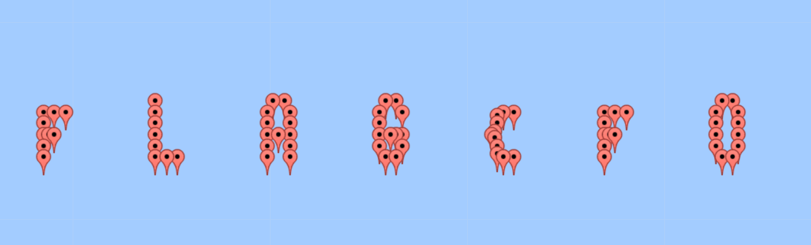

## Connect The Wiggle - 140

### Description

Identify the data contained within wigle and determine how to visualize it. Update 16:26 EST 1 Apr If you feel that you are close, make a private piazza post with what you have, and an admin will help out.

### Hint

  - Perhaps they've been storing data in a database. How do we access the information?
  - How can we visualize this data? Maybe we just need to take a step back to get the big picture?
  - Try zero in the first word of the flag, if you think it's an O.
  - If you think you're super close, make a private piazza post with what you think it is.

### Write up

The sqlite3 DB file is given.

    sqlite> .tables
    android_metadata  location          network
    sqlite> .schema
    CREATE TABLE android_metadata (locale text);
    CREATE TABLE location (_id int, bssid text, level int, lat double, lon double, altitude double, accuracy float, time long);
    CREATE TABLE network (bssid text, ssid text, frequency int, capabilities text, lasttime long, lastlat double, lastlon double, type text);

There are three tables inside.

As googling `wigle`, I found [this site](https://wigle.net/) that shows wireless network mapping.

So, maybe connecting locations in DB will show something.

    sqlite> select lat, lon from location;

    -4.0|-1.96
    -3.99|-1.96
    -3.98|-1.96
    -3.98|-1.955
    -3.98|-1.95
    -3.97|-1.96
    -3.96|-1.96
    -3.96|-1.95
    -3.96|-1.94
    -4.0|-1.86
    -3.99|-1.86
    -3.98|-1.86
    -3.97|-1.86
    -3.96|-1.86
    -3.95|-1.86
    ...

I extracted lat, lon data from the DB.

And used [this site](https://www.darrinward.com/lat-long/) to visulize it.

The points shows the flag.

> FLAG{F0UND_M3_9114AFFC}
