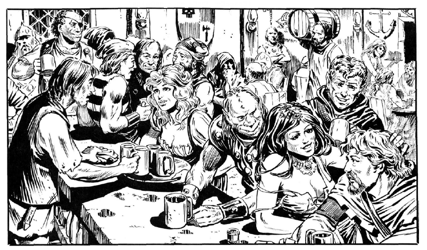
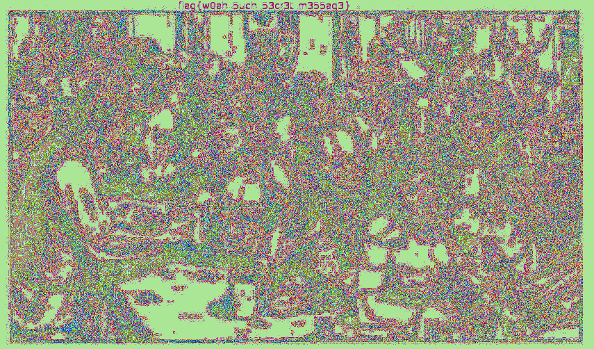

## Wild Night Out

### Description

> That sure was a wild night at the old tavern.
Good thing someone was able to draw the scene for us to remember.
But the more I look at the picture, the more it seems that something isn't quite right...

### Write up

A png file is given.

By checking LSB of the image using tools like `stegsolve`, flag can be easily found.

> flag{w0ah_5uch_53cr3t_m355ag3}
